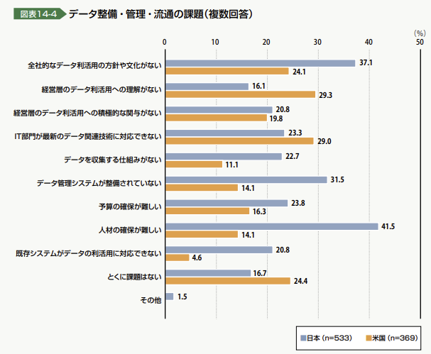
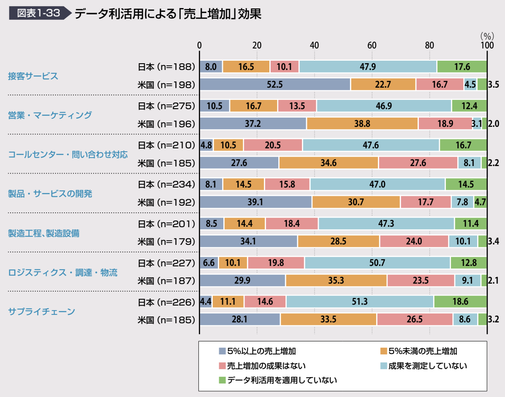
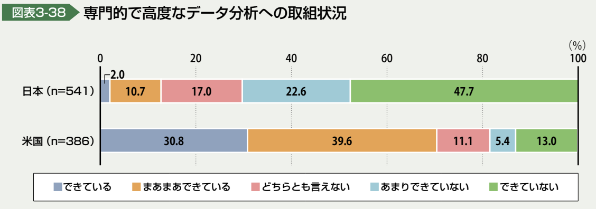
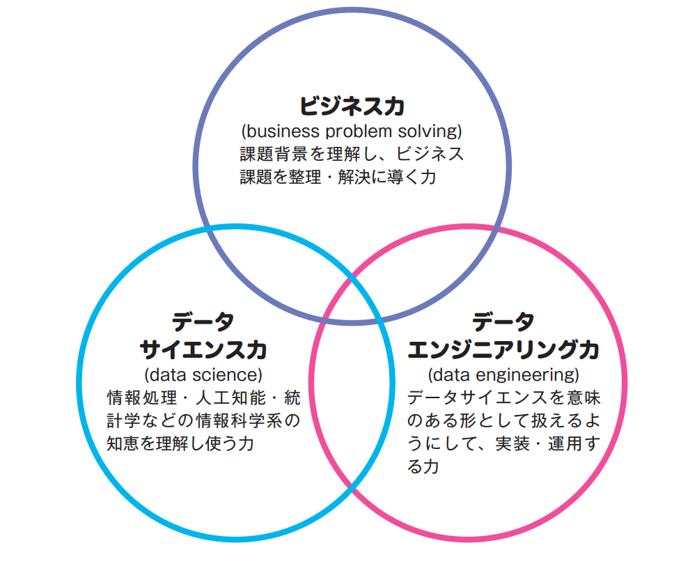
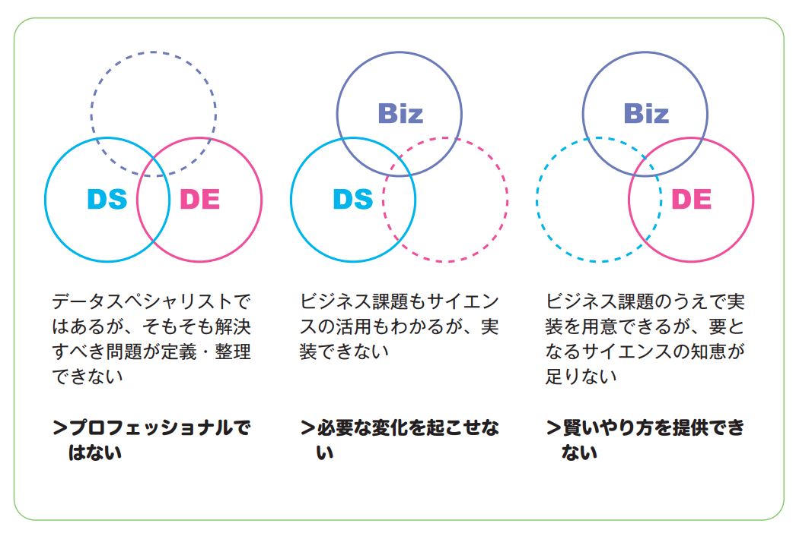

## 1.オープンデータとは？
- 一般公開されている公共データのことです。オープンデータは、国民の生活向上や企業活動の活性化などに繋げることを目的に、主に政府・地方自治体・公的研究機関などが公開を行っています。
- 基本的に、誰でも無料で閲覧・再配布・二次利用（営利目的を含む）することができ、機械判読に適したデータという定義があることも特徴です。

## 2.オープンデータの特徴
- 著作権フリーであること
- 機械判読可能であること

## 3.メリットとデメリット
- [メリット]
  - 行政の透明性が向上する
  - 新しい公的サービスを立ち上げられる
  - ビジネスのアップデートができる

- [デメリット]
  - 利用者に不利益を被るリスクがある
  - 不利益な情報が見える可能性がある

## 4.なぜデータ活用が必要なのか？
- データの分析結果をもとに経営や現場の意思を決定していくことは、経験や勘をベースとした意思決定よりも精度が高いものとなるため、ビジネスはもちろん、医療や交通など幅広い分野で活用されています。
- 企業は最新のIT技術を導入してビッグデータの収集を行いやすい環境となりました。このデータを適切に分析し、分析結果をもとに決められた経営や現場の意思決定は、従来の経験や勘に頼りきった方法よりも精度が高いものとなります。
- データにもとづいた経営判断を行うことをデータドリブン経営
- 日本企業は「適切な情報を必要なタイミングで取り出せる」ことや「部門間で標準化したデータ分析基盤の実現」といったビジネスニーズへの対応が十分できていません。
- 少子高齢化により人口減少が加速し、経済力の低下が懸念されています。データ活用により生産性の向上を目指し、経済の活性化を目的としています。

- 日本企業では「全社的なデータ利活用の方針や文化がない」「データ管理システムが整備されていない」「人材の確保が難しい」といった課題があります。
- データ利活用による効果測定が必要と思われます。
- データサイエンスによって解決できる課題
  - 業務の効率化・コスト削減
  - 売り上げ向上のための戦略策定

## 5.データサイエンティストについて
  - 機械学習や統計などの様々な手法を用い、大量のデータの中から有益な情報を導き出すことができる人材のこと

