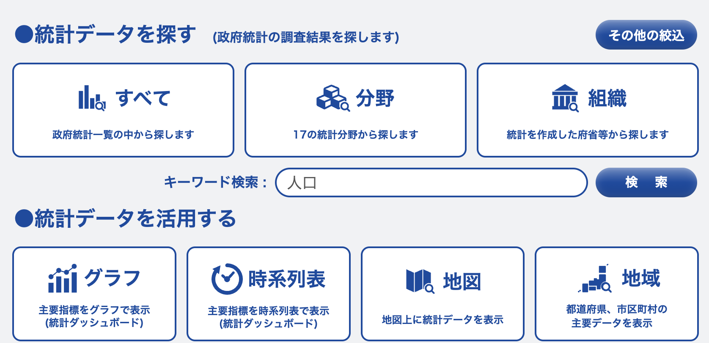
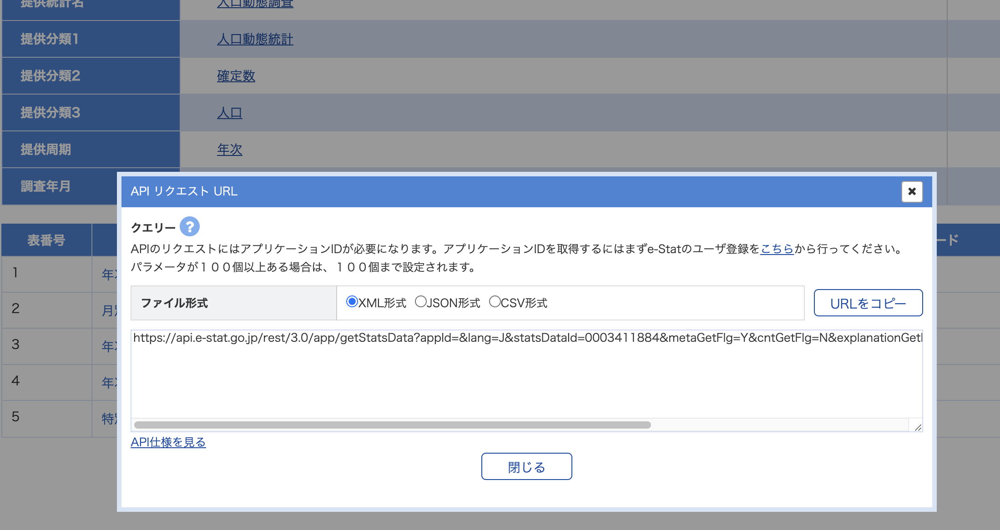

# 3.e-Stat[政府統計の総合窓口]について

- e-Statは日本の統計が閲覧できる政府ポータルサイトです。
- https://www.e-stat.go.jp/
- 開発者向けにAPI機能が備わっているので、APIでJson形式のデータを取得する事ができます。
- APIを使うためにはユーザー登録(無料)とAPI_KEYの発行が必要です。

## API_KEYの発行手順について
- ユーザー登録後、マイページ（https://www.e-stat.go.jp/mypage/view/dashboard）にアクセス。
- API機能(アプリケーションID発行)をクリック。
- 以下の項目を入力後、発行ボタンをクリック。
```
名称（必須）：（任意）
URL（必須）:http://test.localhost/
概要：（任意）

※公開サイトを利用しない場合は「http://test.localhost/」と入力
```

- 発行ボタンをクリック後、appId（API_KEY）が付与されます。

- API機能を使う際は過度なサーバ負担が生じないように規約を守る必要があります。
- https://www.e-stat.go.jp/api/terms-of-use
- (一部抜粋)

- APIボタンを押下し、statsDataIdのパラメータを探す

## 目的のデータのAPIを取得
- 統計データを探します。
- 
- データセット一覧で検索ワードを入力し検索
- 対象のデータのAPIをクリック
- 
- 「statsDataId」を取得します。
  - 【例】[人口動態調査/人口動態統計/確定数/人口/年次・都道府県・性別人口](https://www.e-stat.go.jp/stat-search/database?page=1&layout=dataset&toukei=00450011&tstat=000001028897&year=20220&hclass=10010&statdisp_id=0003411884&metadata=1&data=1)の「statsDataId」は0003411884となります。

## Ryo YOSHIさんが作成したライブラリ「jpy-datareader」
- APIからJsonデータを取込みとメタ情報が多く、表を整えるまでに相当な作業がかかります。
- Ryo YOSHIさんが作成したライブラリ「jpy-datareader」を紹介いたします。
- 下記のブログやPyCon_JPのyoutube動画を参考にして下さい。
  - [ブログ](https://zenn.dev/welliving/articles/924f79be5a4446)
  - [GitHub](https://github.com/well-living/jpy-datareader)
  - [](https://youtu.be/Hl5cokvWkLk?si=lbqUoYeVs3agkbiY)
 